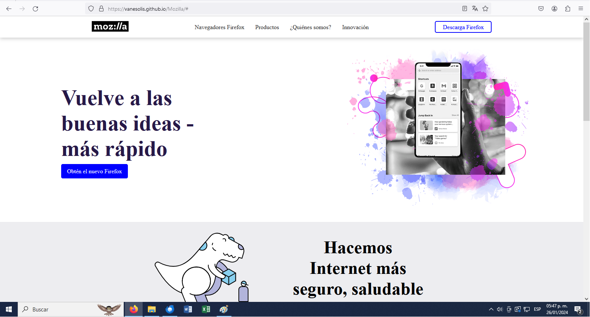
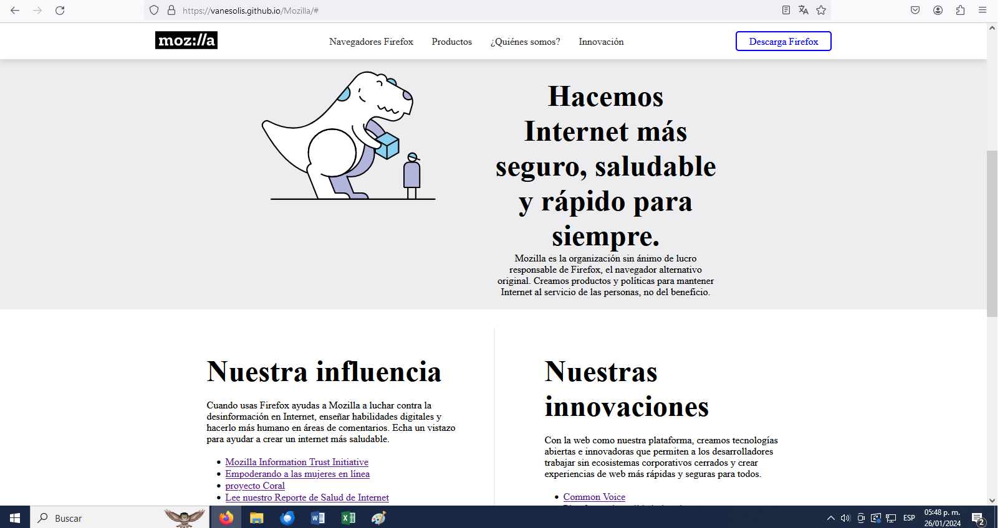
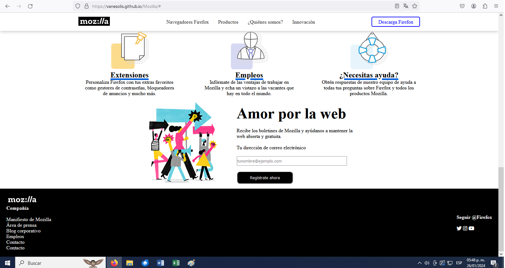

# Mozilla
Este proyecto fue realizado como parte de las actividades del curso de diseño web de la escuela CECATI 30.
Este es fue una práctica de utilización de los elementos de HTML Y CSS para crear un modelo igual al del sitio web original de Mozilla.

### CAPTURAS DE PANTALLA:

## Tecnologías

Esta página web fue creada con:

* HTML
* CSS

Además, se incluyeron **Google Fonts** para personalizar la fuente y **FontAweosome** para incorporar íconos como flechas y logos de redes sociales populares. 

## Español

El texto de la página web está escrito en español, al igual que las clases y atributos personalizados.

Link al sitio: https://vanesolis.github.io/Mozilla/#
